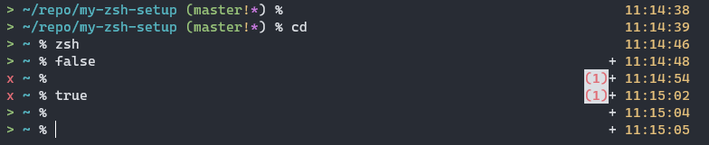

# My Personal ZSH Setup

## .zshrc
I used the default .zshrc generated when I first entered zsh. Basically it configures the command line completion, plus history settings and a default prompt theme.

Here's what I did on top of the default rc file:
- Use my own prompt theme 'zoe'
- Keybindings
    - set to vi keybindings. press ESC to enter normal mode for complex editing
    - map some emacs/bash control keys
- a few aliases

## the prompt theme


This theme is modified based on the 'pws' theme along with the zsh distro. It prints minimal but useful info that I need (on my local computer):
- status indicator: green '>' or red 'x'
- PWD up to 3 levels
- git branch info with changes indicated
    - `!` - staged changes
    - `*` - unstaged changes
- on the right side:
    - status code if non-zero
    - `+` sign if shell is not at top level
    - number of background jobs if any
    - time with Ding! on the hour

I put my prompt theme in .zfuncs, which should be added to zsh's fpath.
To make it loaded correctly, you should change its owner and mode to: (otherwise the `compinit` command will give you warning)
```bash
sudo chown -R ${USER}:root .zfuncs
sudo chmod 755 .zfuncs
```
